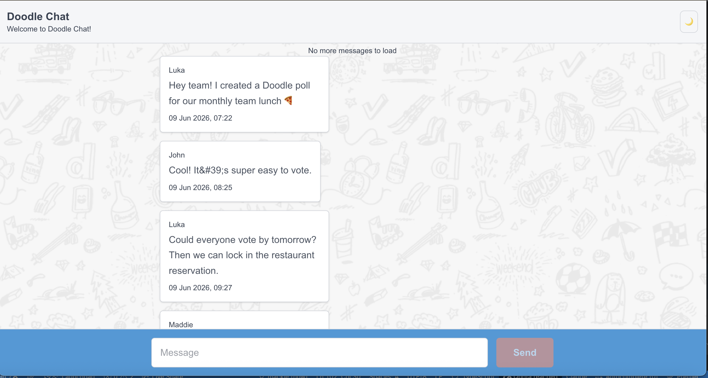

# Doodle Chat

A responsive chat interface built with Next.js, React, TypeScript, Tailwind CSS, and Zod for the Doodle Frontend Engineer challenge.



The app displays messages from all senders, supports sending new messages, loads older messages through pagination, and proxies API requests through a server-side Next.js route so the backend Bearer token is not exposed to the browser.

For the backend implementation details and setup instructions, please refer to the [Frontend Challenge Chat API repository](https://github.com/DoodleScheduling/frontend-challenge-chat-api).

## Features

- Displays chat messages from all senders
- Sends new messages through the Doodle Chat API
- Loads older messages with paginated requests
- Keeps the backend Bearer token server-side
- Responsive layout for mobile and desktop screens
- Light and dark theme support
- Loading, empty, and error states
- Basic retry handling for failed sends
- Runtime validation with Zod
- Accessible form labels, button states, and semantic message markup

## Tech Stack

- Next.js
- React
- TypeScript
- Tailwind CSS
- Zod
- next-themes

## Getting Started

### 1. Clone the frontend repository

```bash
git clone https://github.com/macbrina/doodle-chat.git
cd doodle-chat
```

### 2. Install dependencies

```bash
npm install
```

### 3. Start the backend API

Clone and run the backend API using the instructions in the official backend repository:

[Frontend Challenge Chat API repository](https://github.com/DoodleScheduling/frontend-challenge-chat-api)

By default, the backend API is expected to run at:

```text
http://localhost:3000
```

### 4. Configure environment variables

Create a `.env.local` file in the frontend project root:

```bash
DOODLE_API_BASE_URL=http://localhost:3000
DOODLE_API_TOKEN=super-secret-doodle-token
```

### 5. Start the frontend

Because the backend runs on port `3000`, run the frontend on another port:

```bash
npm run dev -- -p 3001
```

Then open:

```text
http://localhost:3001
```

## Available Scripts

### Start development server

```bash
npm run dev
```

### Build for production

```bash
npm run build
```

### Start production server

```bash
npm run start
```

### Run linting

```bash
npm run lint
```

## Environment Variables

| Variable              | Description                                                   |
| --------------------- | ------------------------------------------------------------- |
| `DOODLE_API_BASE_URL` | Base URL for the Doodle Chat API                              |
| `DOODLE_API_TOKEN`    | Bearer token used to authenticate requests to the backend API |

Example:

```bash
DOODLE_API_BASE_URL=http://localhost:3000
DOODLE_API_TOKEN=super-secret-doodle-token
```

## API Integration

The browser does not call the Doodle backend directly.

Instead, the app uses a Next.js API route:

```text
/api/messages
```

This route forwards requests to the backend API with the required Bearer token.

The flow is:

```text
Browser -> Next.js API route -> Doodle Chat API
```

This keeps the API token out of client-side code while still allowing the frontend to fetch and send messages.

## Project Structure

```text
app/
  api/
    messages/
      route.ts
  favicon.ico
  globals.css
  layout.tsx
  page.tsx

components/
  chat/
    chat-empty-state.tsx
    chat-error.tsx
    chat-header.tsx
    chat-loading.tsx
    chat-shell.tsx
    message-bubble.tsx
    message-composer.tsx
    message-list.tsx
    theme-toggle.tsx
  theme-provider.tsx

hooks/
  use-chat-messages.ts

lib/
  api/
    messages.ts
  schemas/
    api.ts
    message.ts
  server/
    doodle-api.ts
  utils/
    format-date.ts
    helper.ts
    validation.ts

types/
  api.ts
  messages.ts
```

## Implementation Notes

### Server-side API proxy

The app uses a server-side API proxy in `app/api/messages/route.ts` to avoid exposing the backend authentication token in the browser.

### Message state

Message loading, sending, pagination state, and error state are managed in a dedicated `useChatMessages` hook. This keeps the UI components focused on rendering.

### Pagination

Messages are requested with a configurable `limit`. Older messages are loaded with the `before` query parameter and merged into the existing message list while avoiding duplicate message IDs.

### Validation

Zod is used for runtime validation of:

- message payloads
- query parameters
- backend response shapes
- API error response shapes

TypeScript types are inferred from the Zod schemas where appropriate.

### Responsiveness

The chat layout uses a full-height flex structure with a scrollable message area and fixed header/composer regions. The message column is constrained on larger screens while remaining fluid on mobile.

### Accessibility

The interface includes:

- semantic message markup
- labelled message input
- disabled button states
- visible focus states
- error and loading states
- keyboard-friendly message submission

## Notes

This project was completed as part of the Doodle Frontend Engineer challenge. The goal was to keep the implementation focused, readable, responsive, and easy to review while still demonstrating attention to architecture, validation, UX, and accessibility.
